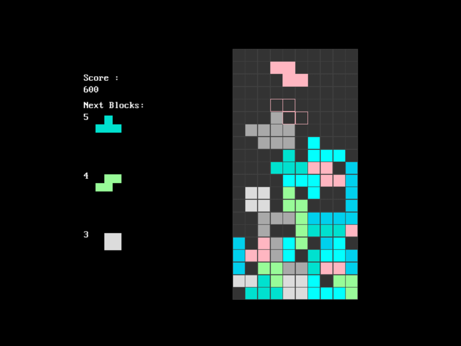

# Tetris
Tetris™ clone created in C++ and SDL, The project is also designed to be compile with emscripten to webasm and be deployed online.

| [Start a new game](https://tetrisplusplus.netlify.app/) |
| --------------------------------------- |

[](https://tetrisplusplus.netlify.app/)


## controls

| key                | Action                   |
|--------------------|--------------------------|
| `left_arrow`       | move left                |
| `right_arrow`      | move right               |
| `z` or `up_arrow`  | rotate clockwise         |
| `x` or `left-ctrl` | rotate counter clockwise |
| `space`            | hard drop                |
| `down_arrow`       | soft drop                |
| `p`                | pause game               |
| `r`                | reset game               |

## Dependencies

- [Git](https://git-scm.com): for version control
- [Standard C++ compiler](https://en.wikipedia.org/wiki/List_of_compilers#cite_ref-15) conforming to C++17 and above standards: to build the project locally (tested on gcc12.0 and clang 13.0)
- [Emscripten](https://emscripten.org) : to compile the program to WebAsm
- [SDL2.0 library](https://github.com/libsdl-org/SDL) :for rendering stuff on screen.
- [SDL TTF library](https://github.com/libsdl-org/SDL_ttf) : for rendering font from TrueType (.ttf) font files.
- [SDL Mixer library](https://github.com/libsdl-org/SDL_mixer) : for playing music and sounds.

## Build instructions
( This section or README.md is still under construction, you may help in improving this by opening a PR/issue regarding the same )

perform the following steps to build the project on your native machine :

1. Clone/download the repository

2. Navigate to `src` subdirectory of repository

3. Now compile the program  (depending on whether you want to build the online deployable version or native build, follow one of the following steps )

   **caveat:** currently the repository doesn't have a build system/script to automate the build process, so sadly for now, manual build is the only way to get the project running on the system (If you are interested in setting up one for the project then feel free to open an issue discussing the same)

    3.1. **WebAsm build using emscripten** :


    To build the online deployable version of the game, we would be using `emscripten` to compile the program to webasm.

    - Executing the following command is I think all you need to compile the project ( do note that Emscripten tend to take relatively long time than your average C++ compiler to build the project, and compilling for the first time would almost always take much longer to build than subsequent builds )
    ``` shell
    $ em++ -std=c++17 renderer.cpp game.cpp app.cpp main.cpp -O2 -s TOTAL_MEMORY=67108864 -s USE_SDL=2 -s USE_SDL_TTF=2 -s USE_SDL_MIXER=2 --preload-file assets -o ../build/index.js
    ```

    TODO: explain what the above command does in detail

    - The build files should be in [`build`](./build) subdirectory of the repository
    - Once in build directory, you can simply use `emrun` to run the HTML pages via a locally launched web server.

    ``` shell
    $ emrun index.html
    ```

    FWIW: you may also like to visit [emscripten documentation](https://emscripten.org/docs/compiling/Building-Projects.html#building-projects) regarding more info about building a project with emscripten if you are interesting to know more about the same.

    3.2. **Native build using native C++ compiler** :

    - Just use your native C++ compiler to build and executable from all the source files (order in which they should be provided to the command should not matter in most cases )

    - Make sure to link `SDL2`, `SDL2_ttf` and `SDL2_mixer` libraries properly.

    ```shell
     $ g++ -std=c++17 renderer.cpp game.cpp app.cpp main.cpp -O2 -lSDL2_ttf -lSDL2_mixer -lSDL2
    ```

    - run the built executable.

These instructions are meant to be understood by developers of every level, so if you are unable to understand anything or face any difficulty in building the project then make sure to complaint about the same by opening an issue or in discuss section.

## For Hacktoberfest

This repository is participating in hacktoberfest, so any contribution done on this project during the month of october should be counted towards hacktoberfest.

## Contribution

Contribution of all kinds ( code, non-code, low-code) are appriciated. 

- If you are looking to contribute to the project then make sure to read [contribution guidelines](./CONTRIBUTING.md) before making a new pull request.

- If you want to report a bug, or want to share ideas/contribute to the project then feel free to open an issue/PR regarding the same

Also feel free to open an issue for asking queries.

**If you liked the project then make sure to support the developers by giving it a star 🤩.**

## License

[](http://badges.mit-license.org)

- **[MIT license](./LICENSE)**
- Copyright 2022 © <a href="https://github.com/Arsenic-ATG" target="_blank">Ankur Saini</a>.
